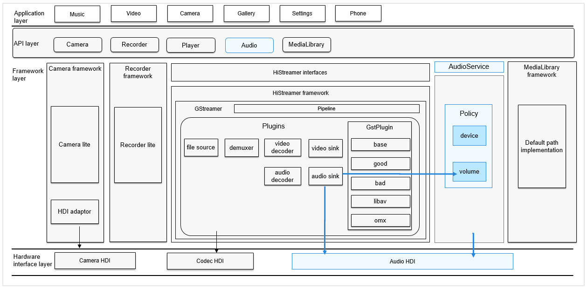

# Audio<a name="EN-US_TOPIC_0000001146901937"></a>

  - [Introduction](#introduction)
    - [Basic Concepts](#basic-concepts)
  - [Directory Structure](#directory-structure)
  - [Usage Guidelines](#usage-guidelines)
    - [Audio Playback](#audio-playback)
    - [Audio Recording](#audio-recording)
    - [Audio Management](#audio-management)
  - [Supported Devices](#supported-devices)
  - [Repositories Involved](#repositories-involved)

## Introduction<a name="introduction"></a>
The **audio\_standard** repository is used to implement audio-related features, including audio playback, recording, volume management and device management.

**Figure  1**  Position in the subsystem architecture<a name="fig483116248288"></a>




### Basic Concepts<a name="basic-concepts"></a>

-   **Sampling**

Sampling is a process to obtain discrete-time signals by extracting samples from analog signals in a continuous time domain at a specific interval.

-   **Sampling rate**

Sampling rate is the number of samples extracted from a continuous signal per second to form a discrete signal. It is measured in Hz. Generally, human hearing range is from 20 Hz to 20 kHz. Common audio sampling rates include 8 kHz, 11.025 kHz, 22.05 kHz, 16 kHz, 37.8 kHz, 44.1 kHz, 48 kHz, and 96 kHz.

-   **Channel**

Channels refer to different spatial positions where independent audio signals are recorded or played. The number of channels is the number of audio sources used during audio recording, or the number of speakers used for audio playback.

-   **Audio frame**

Audio data is in stream form. For the convenience of audio algorithm processing and transmission, it is generally agreed that a data amount in a unit of 2.5 to 60 milliseconds is one audio frame. This unit is called sampling time, and its length is specific to codecs and the application requirements.

-   **PCM**

Pulse code modulation \(PCM\) is a method used to digitally represent sampled analog signals. It converts continuous-time analog signals into discrete-time digital signal samples.

## Directory Structure<a name="directory-structure"></a>

The structure of the repository directory is as follows:

```
/foundation/multimedia/audio_framework  # Audio code
├── frameworks                         # Framework code
│   ├── native                         # Internal Native API Implementation.
|   |                                    Pulseaudio, libsndfile build configuration and pulseaudio-hdi modules
│   └── js                             # External JS API Implementation
        └── napi                       # JS NAPI API Implementation
├── interfaces                         # Interfaces
│   ├── inner_api                      # Internal Native APIs
│   └── kits                           # External JS APIs
├── sa_profile                         # Service configuration profile
├── services                           # Service code
├── LICENSE                            # License file
└── ohos.build                         # Build file
```

## Usage Guidelines<a name="usage-guidelines"></a>
### Audio Playback<a name="audio-playback"></a>
You can use APIs provided in this repository to convert audio data into audible analog signals, play the audio signals using output devices, and manage playback tasks. The following steps describe how to use  **AudioRenderer**  to develop the audio playback function:
1. Use **Create** API with required renderer configuration to get **AudioRenderer** instance.
    ```
    AudioRendererOptions rendererOptions;
    rendererOptions.streamInfo.samplingRate = AudioSamplingRate::SAMPLE_RATE_44100;
    rendererOptions.streamInfo.encoding = AudioEncodingType::ENCODING_PCM;
    rendererOptions.streamInfo.format = AudioSampleFormat::SAMPLE_S16LE;
    rendererOptions.streamInfo.channels = AudioChannel::STEREO;
    rendererOptions.rendererInfo.contentType = ContentType::CONTENT_TYPE_MUSIC;
    rendererOptions.rendererInfo.streamUsage = StreamUsage::STREAM_USAGE_MEDIA;
    rendererOptions.rendererInfo.rendererFlags = 0;

    unique_ptr<AudioRenderer> audioRenderer = AudioRenderer::Create(rendererOptions);
    ```
2. (Optional) Static APIs **GetSupportedFormats**(), **GetSupportedChannels**(), **GetSupportedEncodingTypes**(), **GetSupportedSamplingRates**() can be used to get the supported values of the params.

3. (Optional) use audioRenderer->**GetRendererInfo**(AudioRendererInfo &) and audioRenderer->**GetStreamInfo**(AudioStreamInfo &) to retrieve the current renderer configuration values.

4. Inorder to listen to Audio Interrupt and state change events, it would be required to register to **RendererCallbacks** using audioRenderer->**SetRendererCallback**
    ```
    class AudioRendererCallbackImpl : public AudioRendererCallback {
        void OnInterrupt(const InterruptEvent &interruptEvent) override
        {
            if (interruptEvent.forceType == INTERRUPT_FORCE) { // Forced actions taken by the framework
                switch (interruptEvent.hintType) {
                    case INTERRUPT_HINT_PAUSE:
                        // Force paused. Pause Writing.
                        isRenderPaused_ = true;
                    case INTERRUPT_HINT_STOP:
                        // Force stopped. Stop Writing.
                        isRenderStopped_ = true;
                }
            }
            if (interruptEvent.forceType == INTERRUPT_SHARE) { // Actions not forced, apps can choose to handle.
                switch (interruptEvent.hintType) {
                    case INTERRUPT_HINT_PAUSE:
                        // Do Pause, if required.
                    case INTERRUPT_HINT_RESUME:
                        // After force pause, resume if needed when this hint is received.
                        audioRenderer->Start();
                }
            }
        }

        void OnStateChange(const RendererState state, const StateChangeCmdType cmdType) override
        {
            switch (state) {
                case RENDERER_PREPARED:
                    // Renderer prepared
                case RENDERER_RUNNING:
                    // Renderer in running state
                case RENDERER_STOPPED:
                    // Renderer stopped
                case RENDERER_RELEASED:
                    // Renderer released
                case RENDERER_PAUSED:
                    // Renderer paused
            }
        }
    }

    std::shared_ptr<AudioRendererCallback> audioRendererCB = std::make_shared<AudioRendererCallbackImpl>();
    audioRenderer->SetRendererCallback(audioRendererCB);
    ```

   Implement **AudioRendererCallback** class, override **OnInterrupt** function and register this instance using **SetRendererCallback** API.
   On registering to the callback, the application would receive the interrupt events.

   This will have information on the audio interrupt forced action taken by the Audio framework and also the action hints to be handled by the application. Refer to **audio_renderer.h** and **audio_info.h** for more details.

   Similarly, renderer state change callbacks can be received by overriding **OnStateChange** function in **AudioRendererCallback** class. Refer to **audio_renderer.h** for the list of renderer states.

5. In order to get callbacks for frame mark position and/or frame period position, register for the corresponding callbacks in audio renderer using audioRenderer->**SetRendererPositionCallback** and/or audioRenderer->**SetRendererPeriodPositionCallback** functions respectively.
    ```
    class RendererPositionCallbackImpl : public RendererPositionCallback {
        void OnMarkReached(const int64_t &framePosition) override
        {
            // frame mark reached
            // framePosition is the frame mark number
        }
    }

    std::shared_ptr<RendererPositionCallback> framePositionCB = std::make_shared<RendererPositionCallbackImpl>();
    //markPosition is the frame mark number for which callback is requested.
    audioRenderer->SetRendererPositionCallback(markPosition, framePositionCB);

    class RendererPeriodPositionCallbackImpl : public RendererPeriodPositionCallback {
        void OnPeriodReached(const int64_t &frameNumber) override
        {
            // frame period reached
            // frameNumber is the frame period number
        }
    }

    std::shared_ptr<RendererPeriodPositionCallback> periodPositionCB = std::make_shared<RendererPeriodPositionCallbackImpl>();
    //framePeriodNumber is the frame period number for which callback is requested.
    audioRenderer->SetRendererPeriodPositionCallback(framePeriodNumber, periodPositionCB);
    ```
    For unregistering the position callbacks, call the corresponding audioRenderer->**UnsetRendererPositionCallback** and/or audioRenderer->**UnsetRendererPeriodPositionCallback** APIs.

6. Call audioRenderer->**Start**() function on the AudioRenderer instance to start the playback task.
7. Get the buffer length to be written, using **GetBufferSize** API.
    ```
    audioRenderer->GetBufferSize(bufferLen);
    ```
8.  Read the audio data to be played from the source(for example, an audio file) and transfer it into the bytes stream. Call the **Write** function repeatedly to write the render data.
    ```
    bytesToWrite = fread(buffer, 1, bufferLen, wavFile);
    while ((bytesWritten < bytesToWrite) && ((bytesToWrite - bytesWritten) > minBytes)) {
        int32_t retBytes = audioRenderer->Write(buffer + bytesWritten, bytesToWrite - bytesWritten);
        if (bytesWritten < 0)
            break;
        bytesWritten += retBytes;
    }
    ```
9. In case of audio interrupts, application can encounter write failures. Interrupt unaware applications can check the renderer state using **GetStatus** API before writing audio data further.
Interrupt aware applications will have more details accessible via AudioRendererCallback..
    ```
    while ((bytesWritten < bytesToWrite) && ((bytesToWrite - bytesWritten) > minBytes)) {
        int32_t retBytes = audioRenderer->Write(buffer.get() + bytesWritten, bytesToWrite - bytesWritten);
        if (retBytes < 0) { // Error occurred
            if (audioRenderer_->GetStatus() == RENDERER_PAUSED) { // Query the state and take appropriate action
                isRenderPaused_ = true;
                int32_t seekPos = bytesWritten - bytesToWrite;
                fseek(wavFile, seekPos, SEEK_CUR))
            }
            break;
        }
        bytesWritten += retBytes;
    }
    ```
10. Call audioRenderer->**Drain**() to drain the playback stream.

11. Call audioRenderer->**Stop**() function to Stop rendering.
12. After the playback task is complete, call the audioRenderer->**Release**() function on the AudioRenderer instance to release the stream resources.

13. Use audioRenderer->**SetVolume(float)** and audioRenderer->**GetVolume()** to set and get Track Volume. Value ranges from 0.0 to 1.0

Provided the basic playback usecase above.

Please refer [**audio_renderer.h**](https://gitee.com/openharmony/multimedia_audio_framework/blob/master/interfaces/inner_api/native/audiorenderer/include/audio_renderer.h) and [**audio_info.h**](https://gitee.com/openharmony/multimedia_audio_framework/blob/master/interfaces/inner_api/native/audiocommon/include/audio_info.h) for more such useful APIs.


### Audio Recording<a name="audio-recording"></a>
You can use the APIs provided in this repository for your application to record voices using input devices, convert the voices into audio data, and manage recording tasks. The following steps describe how to use **AudioCapturer** to develop the audio recording function:

1. Use **Create** API with required capturer configuration to get **AudioCapturer** instance.
    ```
    AudioCapturerOptions capturerOptions;
    capturerOptions.streamInfo.samplingRate = AudioSamplingRate::SAMPLE_RATE_48000;
    capturerOptions.streamInfo.encoding = AudioEncodingType::ENCODING_PCM;
    capturerOptions.streamInfo.format = AudioSampleFormat::SAMPLE_S16LE;
    capturerOptions.streamInfo.channels = AudioChannel::MONO;
    capturerOptions.capturerInfo.sourceType = SourceType::SOURCE_TYPE_MIC;
    capturerOptions.capturerInfo.capturerFlags = CAPTURER_FLAG;;

    unique_ptr<AudioCapturer> audioCapturer = AudioCapturer::Create(capturerOptions);
    ```
2. (Optional) Static APIs **GetSupportedFormats**(), **GetSupportedChannels**(), **GetSupportedEncodingTypes**(), **GetSupportedSamplingRates()** can be used to get the supported values of the params.

4. (Optional) use audioCapturer->**GetCapturerInfo**(AudioCapturerInfo &) and audioCapturer->**GetStreamInfo**(AudioStreamInfo &) to retrieve the current capturer configuration values.

5. Capturer state change callbacks can be received by overriding **OnStateChange** function in **AudioCapturerCallback** class, and registering the callback instance using audioCapturer->**SetCapturerCallback** API.
    ```
    class AudioCapturerCallbackImpl : public AudioCapturerCallback {
        void OnStateChange(const CapturerState state) override
        {
            switch (state) {
                case CAPTURER_PREPARED:
                    // Capturer prepared
                case CAPTURER_RUNNING:
                    // Capturer in running state
                case CAPTURER_STOPPED:
                    // Capturer stopped
                case CAPTURER_RELEASED:
                    // Capturer released
            }
        }
    }

    std::shared_ptr<AudioCapturerCallback> audioCapturerCB = std::make_shared<AudioCapturerCallbackImpl>();
    audioCapturer->SetCapturerCallback(audioCapturerCB);
    ```

6. In order to get callbacks for frame mark position and/or frame period position, register for the corresponding callbacks in audio capturer using audioCapturer->**SetCapturerPositionCallback** and/or audioCapturer->**SetCapturerPeriodPositionCallback** functions respectively.
    ```
    class CapturerPositionCallbackImpl : public CapturerPositionCallback {
        void OnMarkReached(const int64_t &framePosition) override
        {
            // frame mark reached
            // framePosition is the frame mark number
        }
    }

    std::shared_ptr<CapturerPositionCallback> framePositionCB = std::make_shared<CapturerPositionCallbackImpl>();
    //markPosition is the frame mark number for which callback is requested.
    audioCapturer->SetCapturerPositionCallback(markPosition, framePositionCB);

    class CapturerPeriodPositionCallbackImpl : public CapturerPeriodPositionCallback {
        void OnPeriodReached(const int64_t &frameNumber) override
        {
            // frame period reached
            // frameNumber is the frame period number
        }
    }

    std::shared_ptr<CapturerPeriodPositionCallback> periodPositionCB = std::make_shared<CapturerPeriodPositionCallbackImpl>();
    //framePeriodNumber is the frame period number for which callback is requested.
    audioCapturer->SetCapturerPeriodPositionCallback(framePeriodNumber, periodPositionCB);
    ```
    For unregistering the position callbacks, call the corresponding audioCapturer->**UnsetCapturerPositionCallback** and/or audioCapturer->**UnsetCapturerPeriodPositionCallback** APIs.

7. Call audioCapturer->**Start**() function on the AudioCapturer instance to start the recording task.

8. Get the buffer length to be read, using **GetBufferSize** API.
    ```
    audioCapturer->GetBufferSize(bufferLen);
    ```
9. Read the captured audio data and convert it to a byte stream. Call the read function repeatedly to read data until you want to stop recording
    ```
    // set isBlocking = true/false for blocking/non-blocking read
    bytesRead = audioCapturer->Read(*buffer, bufferLen, isBlocking);
    while (numBuffersToCapture) {
        bytesRead = audioCapturer->Read(*buffer, bufferLen, isBlockingRead);
        if (bytesRead < 0) {
            break;
        } else if (bytesRead > 0) {
            fwrite(buffer, size, bytesRead, recFile); // example shows writes the recorded data into a file
            numBuffersToCapture--;
        }
    }
    ```
10. (Optional) Call audioCapturer->**Flush**() to flush the capture buffer of this stream.
11. Call the audioCapturer->**Stop**() function on the AudioCapturer instance to stop the recording.
12. After the recording task is complete, call the audioCapturer->**Release**() function on the AudioCapturer instance to release the stream resources.

Provided the basic recording usecase above. Please refer [**audio_capturer.h**](https://gitee.com/openharmony/multimedia_audio_framework/blob/master/interfaces/inner_api/native/audiocapturer/include/audio_capturer.h) and [**audio_info.h**](https://gitee.com/openharmony/multimedia_audio_framework/blob/master/interfaces/inner_api/native/audiocommon/include/audio_info.h) for more APIs.

### Audio Management<a name="audio-management"></a>
You can use the APIs provided in [**audio_system_manager.h**](https://gitee.com/openharmony/multimedia_audio_framework/blob/master/interfaces/inner_api/native/audiomanager/include/audio_system_manager.h) to control volume and device.
1. Use **GetInstance** API to get **AudioSystemManager** instance.
    ```
    AudioSystemManager *audioSystemMgr = AudioSystemManager::GetInstance();
    ```
#### Volume Control
2. Use **GetMaxVolume** and  **GetMinVolume** APIs to query the Maximum & Minimum volume level allowed for the stream. Use this volume range to set the volume.
    ```
    AudioVolumeType streamType = AudioVolumeType::STREAM_MUSIC;
    int32_t maxVol = audioSystemMgr->GetMaxVolume(streamType);
    int32_t minVol = audioSystemMgr->GetMinVolume(streamType);
    ```
3. Use **SetVolume** and **GetVolume** APIs to set and get the volume level of the stream.
    ```
    int32_t result = audioSystemMgr->SetVolume(streamType, 10);
    int32_t vol = audioSystemMgr->GetVolume(streamType);
    ```
4. Use **SetMute** and **IsStreamMute** APIs to set and get the mute status of the stream.
    ```
    int32_t result = audioSystemMgr->SetMute(streamType, true);
    bool isMute = audioSystemMgr->IsStreamMute(streamType);
5. Use **SetRingerMode** and **GetRingerMode** APIs to set and get ringer modes. Refer **AudioRingerMode** enum in [**audio_info.h**](https://gitee.com/openharmony/multimedia_audio_framework/blob/master/interfaces/inner_api/native/audiocommon/include/audio_info.h) for supported ringer modes.
    ```
    int32_t result = audioSystemMgr->SetRingerMode(RINGER_MODE_SILENT);
    AudioRingerMode ringMode = audioSystemMgr->GetRingerMode();
    ```
6. Use **SetMicrophoneMute** and **IsMicrophoneMute** APIs to mute/unmute the mic and to check if mic muted.
    ```
    int32_t result = audioSystemMgr->SetMicrophoneMute(true);
    bool isMicMute = audioSystemMgr->IsMicrophoneMute();
    ```
#### Device control
7. Use **GetDevices**, **deviceType_** and **deviceRole_** APIs to get audio I/O devices information. For DeviceFlag, DeviceType and DeviceRole enums refer [**audio_info.h**](https://gitee.com/openharmony/multimedia_audio_framework/blob/master/interfaces/inner_api/native/audiocommon/include/audio_info.h).
    ```
    DeviceFlag deviceFlag = ALL_DEVICES_FLAG;
    vector<sptr<AudioDeviceDescriptor>> audioDeviceDescriptors = audioSystemMgr->GetDevices(deviceFlag);
    for (auto &audioDeviceDescriptor : audioDeviceDescriptors) {
        cout << audioDeviceDescriptor->deviceType_ << endl;
        cout << audioDeviceDescriptor->deviceRole_ << endl;
    }
    ```
8. Use **SetDeviceActive** and **IsDeviceActive** APIs to Actiavte/Deactivate the device and to check if the device is active.
     ```
    ActiveDeviceType deviceType = SPEAKER;
    int32_t result = audioSystemMgr->SetDeviceActive(deviceType, true);
    bool isDevActive = audioSystemMgr->IsDeviceActive(deviceType);
    ```

9. Use **SetDeviceChangeCallback** API to register for device change events. Clients will receive callback when a device is connected/disconnected. Currently audio subsystem supports sending device change events for WIRED_HEADSET, USB_HEADSET and BLUETOOTH_A2DP device.
**OnDeviceChange** function will be called and client will receive **DeviceChangeAction** object, which will contain following parameters:\
*type* : **DeviceChangeType** which specifies whether device is connected or disconnected.\
*deviceDescriptors* : Array of **AudioDeviceDescriptor** object which specifies the type of device and its role(input/output device).
     ```
    class DeviceChangeCallback : public AudioManagerDeviceChangeCallback {
    public:
        DeviceChangeCallback = default;
        ~DeviceChangeCallback = default;
        void OnDeviceChange(const DeviceChangeAction &deviceChangeAction) override
        {
            cout << deviceChangeAction.type << endl;
            for (auto &audioDeviceDescriptor : deviceChangeAction.deviceDescriptors) {
                switch (audioDeviceDescriptor->deviceType_) {
                    case DEVICE_TYPE_WIRED_HEADSET: {
                        if (deviceChangeAction.type == CONNECT) {
                            cout << wired headset connected << endl;
                        } else {
                            cout << wired headset disconnected << endl;
                        }
                        break;
                    }
                    case DEVICE_TYPE_USB_HEADSET:{
                        if (deviceChangeAction.type == CONNECT) {
                            cout << usb headset connected << endl;
                        } else {
                            cout << usb headset disconnected << endl;
                        }
                        break;
                    }
                    case DEVICE_TYPE_BLUETOOTH_A2DP:{
                        if (deviceChangeAction.type == CONNECT) {
                            cout << Bluetooth device connected << endl;
                        } else {
                            cout << Bluetooth device disconnected << endl;
                        }
                        break;
                    }
                    default: {
                        cout << "Unsupported device" << endl;
                        break;
                    }
                }
            }
        }
    };

    auto callback = std::make_shared<DeviceChangeCallback>();
    audioSystemMgr->SetDeviceChangeCallback(callback);
    ```

10. Other useful APIs such as **IsStreamActive**, **SetAudioParameter** and **GetAudioParameter** are also provided. Please refer [**audio_system_manager.h**](https://gitee.com/openharmony/multimedia_audio_framework/blob/master/interfaces/inner_api/native/audiomanager/include/audio_system_manager.h) for more details

11. Applications can register for change in system volume using **AudioManagerNapi::On**. Here when an application registers to volume change event, whenever there is change in volume, the application is notified with following parameters:
volumeType : The AudioVolumeType for which volume is updated
volume : The curret volume level set.
updateUi : Whether the volume change details need to be shown or not. (If volume is updated through volume key up/down we set the updateUi flag to true, in other scenarios the updateUi is set as false).
    ```
    const audioManager = audio.getAudioManager();

    export default {
         onCreate() {
             audioManager.on('volumeChange', (volumeChange) ==> {
                 console.info('volumeType = '+volumeChange.volumeType);
                 console.info('volume = '+volumeChange.volume);
                 console.info('updateUi = '+volumeChange.updateUi);
             }
         }
    }
    ```

#### Audio Scene
12. Use **SetAudioscene** and **getAudioScene** APIs to change and check the audio strategy, respectively.
    ```
    int32_t result = audioSystemMgr->SetAudioScene(AUDIO_SCENE_PHONE_CALL);
    AudioScene audioScene = audioSystemMgr->GetAudioScene();
    ```
Please refer **AudioScene** enum in [**audio_info.h**](https://gitee.com/openharmony/multimedia_audio_framework/blob/master/interfaces/inner_api/native/audiocommon/include/audio_info.h) for supported audio scenes.

#### JavaScript Usage:
JavaScript apps can use the APIs provided by audio manager to control the volume and the device.\
Please refer [**js-apis-audio.md**](https://gitee.com/openharmony/docs/blob/master/en/application-dev/reference/apis/js-apis-audio.md#audiomanager) for complete JavaScript APIs available for audio manager.

### Ringtone Management<a name="ringtone-management"></a>
You can use the APIs provided in [**iringtone_sound_manager.h**](https://gitee.com/openharmony/multimedia_audio_framework/blob/master/interfaces/inner_api/native/audioringtone/include/iringtone_sound_manager.h) and [**iringtone_player.h**](https://gitee.com/openharmony/multimedia_audio_framework/blob/master/interfaces/inner_api/native/audioringtone/include/iringtone_player.h) for ringtone playback functions.
1. Use **CreateRingtoneManager** API to get **IRingtoneSoundManager** instance.
    ```
    std::shared_ptr<IRingtoneSoundManager> ringtoneManagerClient = RingtoneFactory::CreateRingtoneManager();
    ```
2. Use **SetSystemRingtoneUri** API to set the system ringtone uri.
    ```
    std::string uri = "/data/media/test.wav";
    RingtoneType ringtoneType = RINGTONE_TYPE_DEFAULT;
    ringtoneManagerClient->SetSystemRingtoneUri(context, uri, ringtoneType);
    ```
3. Use **GetRingtonePlayer** API to get **IRingtonePlayer** instance.
    ```
    std::unique_ptr<IRingtonePlayer> ringtonePlayer = ringtoneManagerClient->GetRingtonePlayer(context, ringtoneType);
    ```
4. Use **Configure** API to configure the ringtone player.
    ```
    float volume = 1;
    bool loop = true;
    ringtonePlayer.Configure(volume, loop);
    ```
5. Use **Start**, **Stop**, and **Release** APIs on ringtone player instance to control playback states.
    ```
    ringtonePlayer.Start();
    ringtonePlayer.Stop();
    ringtonePlayer.Release();
    ```
6. Use **GetTitle** API to get the title of current system ringtone.
7. Use **GetRingtoneState** to the the ringtone playback state - **RingtoneState**
8. Use **GetAudioRendererInfo** to get the **AudioRendererInfo** to check the content type and stream usage.


## Supported devices<a name="supported-devices"></a>
Currently following are the list of device types supported by audio subsystem.

1. **USB Type-C Headset**\
    Digital headset which includes their own DAC (Digital to Analogue Converter) and amp as part of the headset.
2. **WIRED Headset**\
    Analog headset which doesn't contain any DAC inside. It can have 3.5mm jack or Type-C jack without DAC.
3. **Bluetooth Headset**\
    Bluetooth A2DP(Advanced Audio Distribution Profile) headset used for streaming audio wirelessly.
4. **Internal Speaker and MIC**\
    Internal speaker and mic is supported and will be used as default device for playback and record respectively.

## Repositories Involved<a name="repositories-involved"></a>

[multimedia\_audio\_framework](https://gitee.com/openharmony/multimedia_audio_framework)
