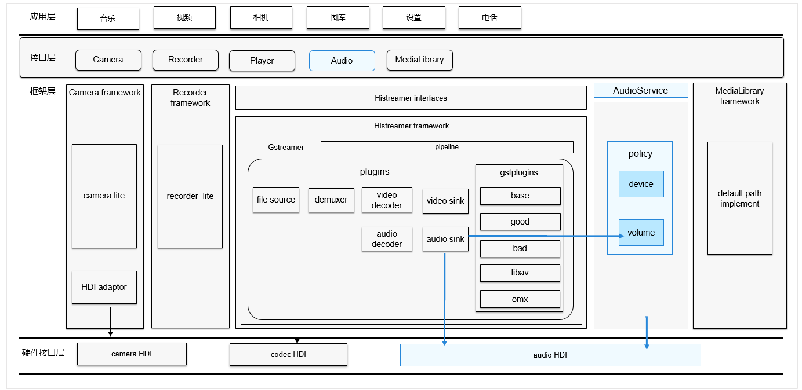

# 音频组件<a name="ZH-CN_TOPIC_0000001146901937"></a>

-   [简介](#section119mcpsimp)
    -   [基本概念](#section122mcpsimp)

-   [目录](#section179mcpsimp)
-   [使用说明](#section112738505318)
    -   [音频播放](#section1147510562812)
    -   [音频录制](#section295162052813)
    -   [音频管理](#section645572311287)

-   [相关仓](#section340mcpsimp)

## 简介<a name="section119mcpsimp"></a>

音频组件用于实现音频相关的功能，包括音频播放，录制，音量管理和设备管理。

**图 1**  音频组件架构图<a name="fig483116248288"></a>  




### 基本概念<a name="section122mcpsimp"></a>

-   **采样**

采样是指将连续时域上的模拟信号按照一定的时间间隔采样，获取到离散时域上离散信号的过程。

-   **采样率**

采样率为每秒从连续信号中提取并组成离散信号的采样次数，单位用赫兹（Hz）来表示。通常人耳能听到频率范围大约在20Hz～20kHz之间的声音。常用的音频采样频率有：8kHz、11.025kHz、22.05kHz、16kHz、37.8kHz、44.1kHz、48kHz、96kHz、192kHz等。

-   **声道**

声道是指声音在录制或播放时在不同空间位置采集或回放的相互独立的音频信号，所以声道数也就是声音录制时的音源数量或回放时相应的扬声器数量。

-   **音频帧**

音频数据是流式的，本身没有明确的一帧帧的概念，在实际的应用中，为了音频算法处理/传输的方便，一般约定俗成取2.5ms\~60ms为单位的数据量为一帧音频。这个时间被称之为“采样时间”，其长度没有特别的标准，它是根据编解码器和具体应用的需求来决定的。

-   **PCM**

PCM（Pulse Code Modulation），即脉冲编码调制，是一种将模拟信号数字化的方法，是将时间连续、取值连续的模拟信号转换成时间离散、抽样值离散的数字信号的过程。

## 目录<a name="section179mcpsimp"></a>

仓目录结构如下：

```
/foundation/multimedia/audio_standard  # 音频组件业务代码
├── frameworks                         # 框架代码
│   ├── innerkitsimpl                  # 内部接口实现
│   └── kitsimpl                       # 外部接口实现
├── interfaces                         # 接口代码
│   ├── innerkits                      # 内部接口
│   └── kits                           # 外部接口
├── sa_profile                         # 服务配置文件
├── services                           # 服务代码
├── LICENSE                            # 证书文件
└── ohos.build                         # 编译文件
```

## 使用说明<a name="section112738505318"></a>

### 音频播放<a name="section1147510562812"></a>

可以使用此仓库内提供的接口将音频数据转换为音频模拟信号，使用输出设备播放音频信号，以及管理音频播放任务。以下步骤描述了如何使用AudioRenderer开发音频播放功能：

1.  使用Create接口和所需流类型来获取AudioRenderer实例。

    ```
    AudioStreamType streamType = STREAM_MUSIC; // 流类型示例
    std::unique_ptr<AudioRenderer> audioRenderer = AudioRenderer::Create(streamType);
    ```

2.  （可选）静态API GetSupportedFormats\(\), GetSupportedChannels\(\), GetSupportedEncodingTypes\(\), GetSupportedSamplingRates\(\) 可用于获取支持的参数。
3.  准备设备，调用实例的SetParams。

    ```
    AudioRendererParams rendererParams; 
    rendererParams.sampleFormat = SAMPLE_S16LE; 
    rendererParams.sampleRate = SAMPLE_RATE_44100; rendererParams.channelCount = STEREO；
    rendererParams.encodingType = ENCODING_PCM;
     
    audioRenderer->SetParams(rendererParams);
    ```

4.  （可选）使用audioRenderer-\>GetParams（rendererParams）来验证SetParams。
5.  AudioRenderer 实例调用audioRenderer-\>Start\(\) 函数来启动播放任务。
6.  使用GetBufferSize接口获取要写入的缓冲区长度。

    ```
    audioRenderer->GetBufferSize(bufferLen);
    ```

7.  从源（例如音频文件）读取要播放的音频数据并将其传输到字节流中。重复调用Write函数写入渲染数据。

    ```
    bytesToWrite = fread(buffer, 1, bufferLen, wavFile);
    while ((bytesWritten < bytesToWrite) && ((bytesToWrite - bytesWritten) > minBytes)) {
        bytesWritten += audioRenderer->Write(buffer + bytesWritten, bytesToWrite - bytesWritten);
        if (bytesWritten < 0)
            break;
    }
    ```

8.  调用audioRenderer-\>Drain\(\)来清空播放流。
9.  调用audioRenderer-\>Stop\(\)来停止输出。
10. 播放任务完成后，调用AudioRenderer实例的audioRenderer-\>Release\(\)函数来释放资源。

提供上述基本音频播放使用范例。更多接口说明请参考audio\_renderer.h 和audio\_info.h。

### 音频录制<a name="section295162052813"></a>

可以使用此仓库内提供的接口，让应用程序可以完成使用输入设备进行声音录制，将语音转换为音频数据，并管理录制的任务。以下步骤描述了如何使用AudioReorder开发音频录制功能：

1.  使用Create接口和所需流类型来获取AudioRecorder实例。

    ```
    AudioStreamType streamType = STREAM_MUSIC; 
    std::unique_ptr<AudioRecorder> audioRecorder = AudioRecorder::Create(streamType);
    ```

2.  （可选）静态API GetSupportedFormats\(\), GetSupportedChannels\(\), GetSupportedEncodingTypes\(\), GetSupportedSamplingRates\(\) 可用于获取支持的参数。
3.  准备设备，调用实例的SetParams。

    ```
    AudioRecorderParams recorderParams; 
    recorderParams.sampleFormat = SAMPLE_S16LE; 
    recorderParams.sampleRate = SAMPLE_RATE_44100; recorderParams.channelCount = STEREO；
    recorderParams.encodingType = ENCODING_PCM;
     
    audioRecorder->SetParams(recorderParams);
    ```

4.  （可选）使用 audioRecorder-\>GetParams\(recorderParams\) 来验证 SetParams\(\)。
5.  AudioRecorder 实例调用 audioRenderer-\>Start\(\) 函数来启动录音任务。
6.  使用GetBufferSize接口获取要写入的缓冲区长度。

    ```
    audioRecorder->GetBufferSize(bufferLen);
    ```

7.  读取录制的音频数据并将其转换为字节流。重复调用read函数读取数据直到主动停止。

    ```
    // set isBlocking = true/false for blocking/non-blocking read
    bytesRead = audioRecorder->Read(*buffer, bufferLen, isBlocking);
    while (numBuffersToRecord) {
        bytesRead = audioRecorder->Read(*buffer, bufferLen, isBlockingRead);
        if (bytesRead < 0) {
            break;
        } else if (bytesRead > 0) {
            fwrite(buffer, size, bytesRead, recFile); // example shows writes the recored data into a file
            numBuffersToRecord--;
        }
    }
    ```

8.  （可选）调用audioRecorder-\>Flush\(\) 来清空录音流缓冲区。
9.  AudioRecorder 实例调用 audioRecorder-\>Stop\(\) 函数停止录音。
10. 录音任务完成后，调用AudioRecorder 实例的audioRecorder-\>Release\(\) 函数释放资源。

提供上述基本音频录制使用范例。更多API请参考audio\_recorder.h和audio\_info.h。

### 音频管理<a name="section645572311287"></a>

JS应用可以使用音频管理器提供的API来控制音量和设备。有关音频音量和设备管理的JS用法，请参考音频管理JS接口说明。

## 相关仓<a name="section340mcpsimp"></a>

[multimedia\_audio\_standard](https://gitee.com/openharmony/multimedia_audio_standard)

